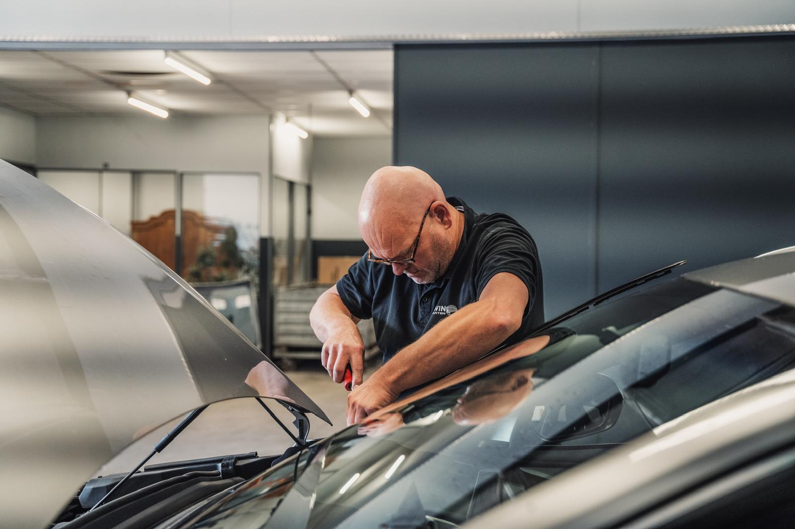
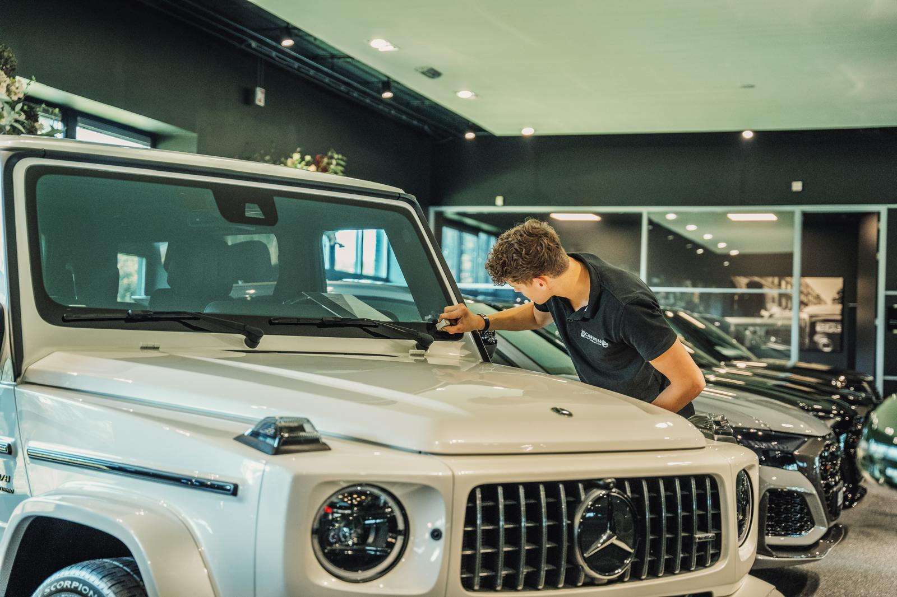
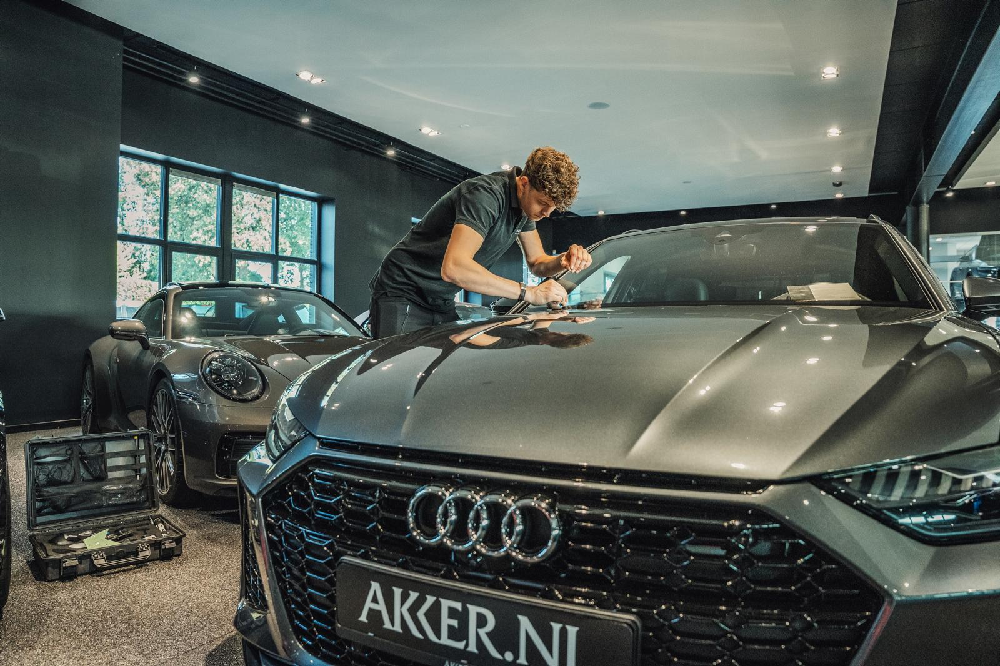

# Foto's voor de 123RUIT-pagina

Plaats hier de volgende bestanden zodat ze op de 123RUIT-pagina zichtbaar zijn:

| Bestandsnaam | Gebruik |
|--------------|---------|
| `123ruit-hero-1.jpg` | Hero-achtergrond (monteur/voorruit) |
| `123ruit-network-2.jpg` | Split-secties: showroom/technician |
| `123ruit-workshop-3.jpg` | Werkplaats / monteur aan het werk |
| `123ruit-logo-black.png` | 123RUIT.nl partnerlogo |

**Locatie:** Alle bestanden in deze map (`client/public/images/`) worden door de site geserveerd onder `/images/...`.

Na het toevoegen van de bestanden zouden de foto's direct zichtbaar moeten zijn (eventueel na een refresh).

